# tensorflow-mnist-manifolds
Exploration of different dimensionality reduction techniques on the MNIST dataset.
 - Variational AutoEncoders (VAE)
 - Dense NN and CNN classifiers
 - Linear approaches: PCA, LDA
 - Non-linear approaches: UMAP, t-SNE

## VAE latent representations

- Dimensionality reduction (2D representation)

    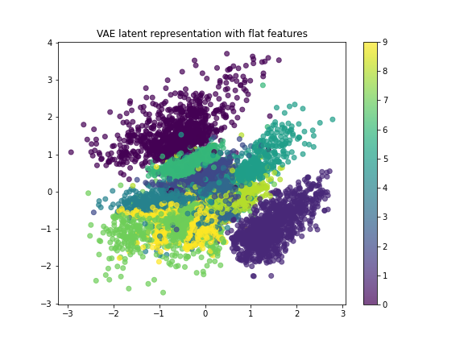
    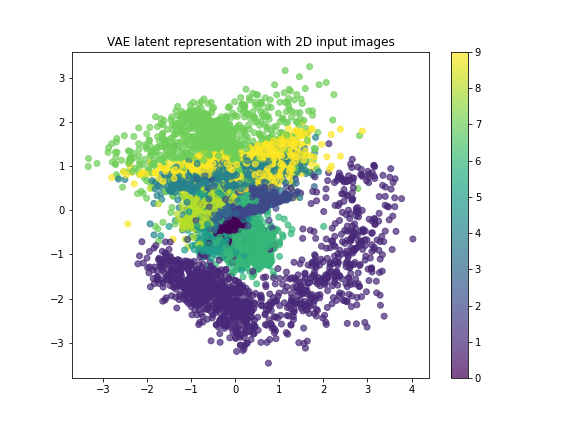

- Learnt representations from VAEs (variation of _mu_ and _log_var_ on the axis).

    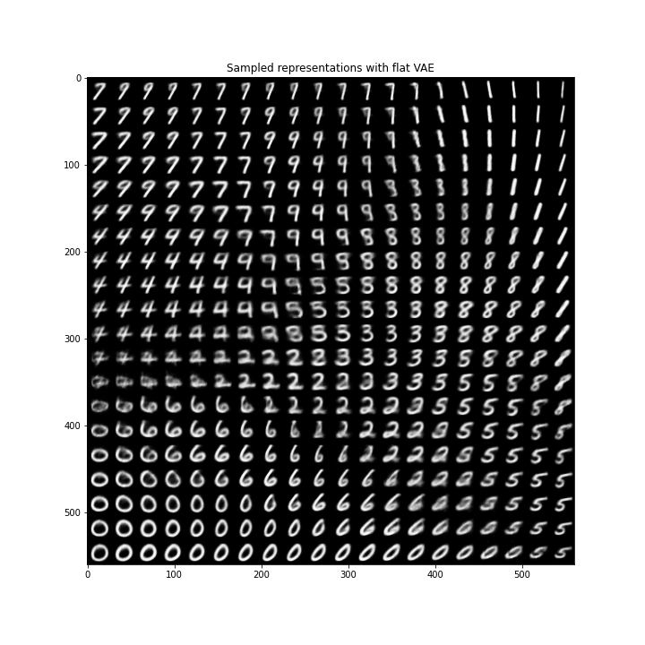
    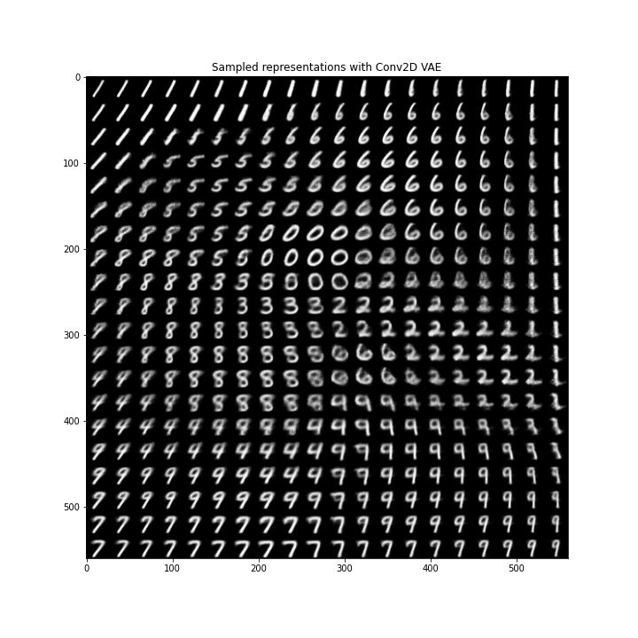

## NN and CNN classifiers

Learned MNIST manifold (2D latent space) along batches while learning classification task. We can observe how the neural network tries to fing the most suitable 2D representation to easily discriminate the different categories (probabli better than VAE):

### Flat features vs. 2D features (convolutional)

    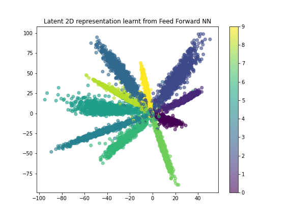
    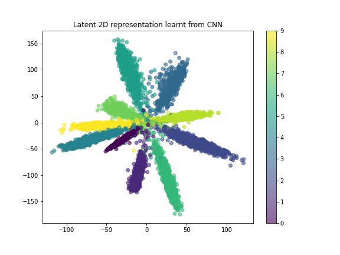

## Linear dimensionality reduction approaches
- PCA

    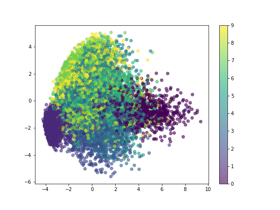
    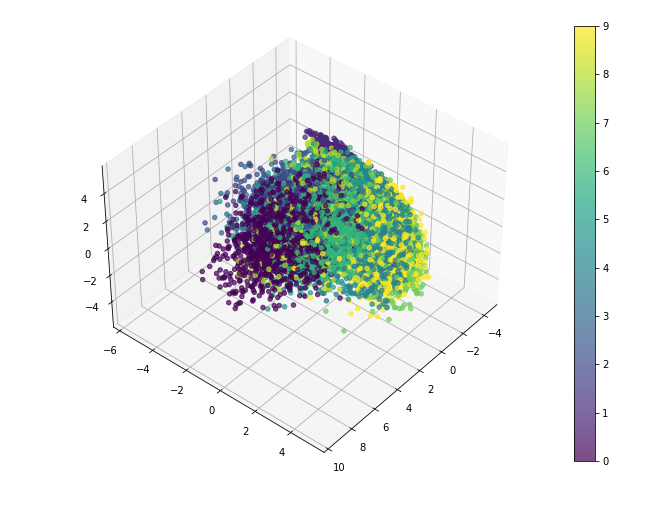

- LDA

    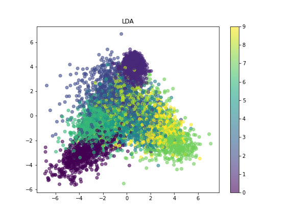
    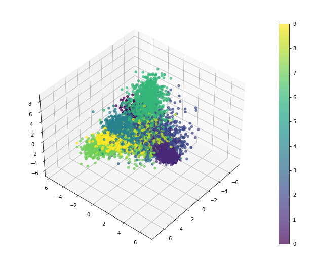

## Non-linear dimensionality reduction approaches

- UMAP

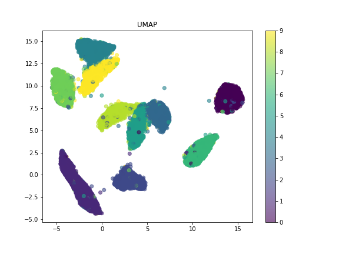

- t-SNE

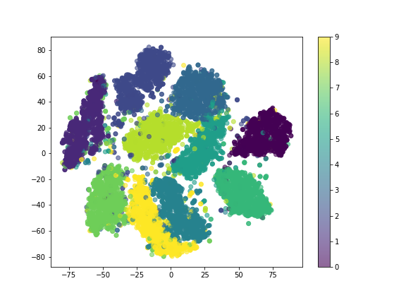

## Conclusions

- Manifolds and latent representation learnt by NN and CNN classifiers is the since the networks have the  specific task of class separation (at least more interpretable than VAEs).

- UMAP provides interesting embeddings, and helps to easily identify outliers with acceptable computation time.
